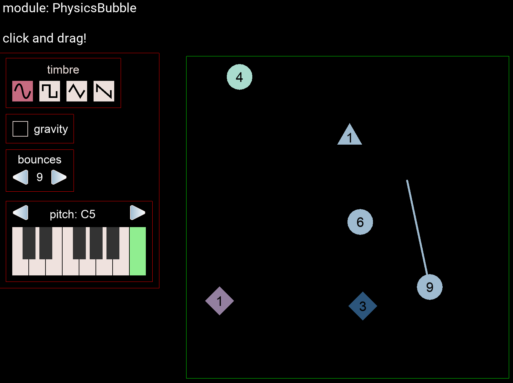

# interval

### project members
- joon ko (joonhok@mit.edu)
- nisha devasia (ndevasia@mit.edu)

### [proposal document](https://docs.google.com/document/d/1v-Yr0-7mmmqrQtp-VLZKAsVBiACLiTvRRZDyHPhV9q4/edit?usp=sharing)

### [presentation + demo](https://musictech.mit.edu/blog/interval)

### installing class-specific dependencies
interval was a final project developed for **interactive music systems** (spring 2020), a class taught by eran egozy at mit. the class was taught in python, and used the application framework [kivy](https://kivy.org/#home). at the beginning of the term, every student in the class ran a script to install the specific dependencies we'd need for the class. the steps of the script are reproduced below.

1. check that [homebrew](https://brew.sh/) is installed.
2. `brew_install portaudio`
3. `brew_install fluidsynth`
4. check that python/pip is installed (ideally version 3.7+).
5. `pip install kivy`
6. `pip install numpy`
7. `pip install python-osc`
8. `pip install python-rtmidi`
9. `pip install pyaudio`

### setup locally
1. we assume you have all 21M.385 dependencies installed (esp. Kivy).
2. clone and cd into this repository (make sure you're in the location interval/)
3. `pip install -r requirements.txt`
4. ensure that your internet connection is running
5. `python client.py` for windows, `python client.py mac` 

### sound modules

**interval** is a collaborative music sandbox that works by deploying customizable *sound modules*. currently, you can switch sound modules using the zxc keys. (see the keyboard shortcuts below!)

**PhysicsBubble** (z key) is a physics-based sound bubble that collides with the sandbox edges as well as SoundBlocks. to make a PhysicsBubble, simply click and drag somewhere in the sandbox to 'slingshot' a bubble, and let it go! each PhysicsBubble has a pitch, timbre, and number of bounces associated with it. there is also a gravity toggle.

**SoundBlock** (x key) is a static sound block that makes a sound when either a PhysicsBubble hits it, a user clicks it with a mouse, or a TempoCursor activates it. to make a SoundBlock, click and drag in the sandbox to draw a rectangle. let go to release and deploy. each SoundBlock has a pitch and instrument associated with it.

**TempoCursor** (c key) doesn't make any music on its own, but can be placed *over* static sound modules to activate them exactly the same way a mouse click would. the difference between your mouse and a TempoCursor is that they are configurable to click at a specific rhythm. the GUI for TempoCursor is not fleshed out right now, and there's just a 4x4 white grid -- this represents 16th note subdivisions in a 4-beat measure. to use a TempoCursor, select the rhythm you want using the grid, and then click over a static sound module like SoundBlock to deploy. you'll see a white circle with a rotating black tick, which is the 'current' tick marker, and several static blue ticks which represent the rhythm you chose. when the black tick position lines up with the blue tick position, the TempoCursor activates, 'clicking' the sound module underneath.

we are currently working on more sound modules -- namely, at least one more static module that works with simultaneous or arpeggiated chords, and one module that can play more melodic note sequences, in contrast to SoundBlocks which can only play one instrument and pitch. we're also working to extend SoundBlock to have percussion/drum sounds.

### on collaborative playtesting

**interval** was designed to be both a single-player and multiplayer experience -- we encourage playtesting with multiple people! under the hood, when you run `python client.py`, you connect to a server currently hosted on heroku, and the server is responsible for managing all the different clients that connect to it.

#### keyboard shortcuts (be a pro!)

- **space**: play/stop recording music! recordings are saved in `recordings/`.
- **z**: PhysicsBubble
- **x**: SoundBlock
- **c**: TempoCursor
- **PhysicsBubble**
  - **qwertyui**: pitch select (white keys)
  - **23567**: pitch select (black keys)
  - **[**, **]**: pitch select octave down, octave up
  - **asdf**: timbre select (sine, square, triangle, sawtooth)
  - **g**: toggle gravity
  - **left**, **right**: # of bounces down, up
  - **v**: toggle delete mode 
- **SoundBlock**
  - **qwertyui**: pitch select (white keys)
  - **23567**: pitch select (black keys)
  - **asdfg**: instrument select
  - **d**: toggle delete mode (click block to delete)
  - **v**: toggle delete mode 
- **TempoCursor**
  - **up**, **down**: increase/decrease tempo
  - **v**: toggle delete mode
