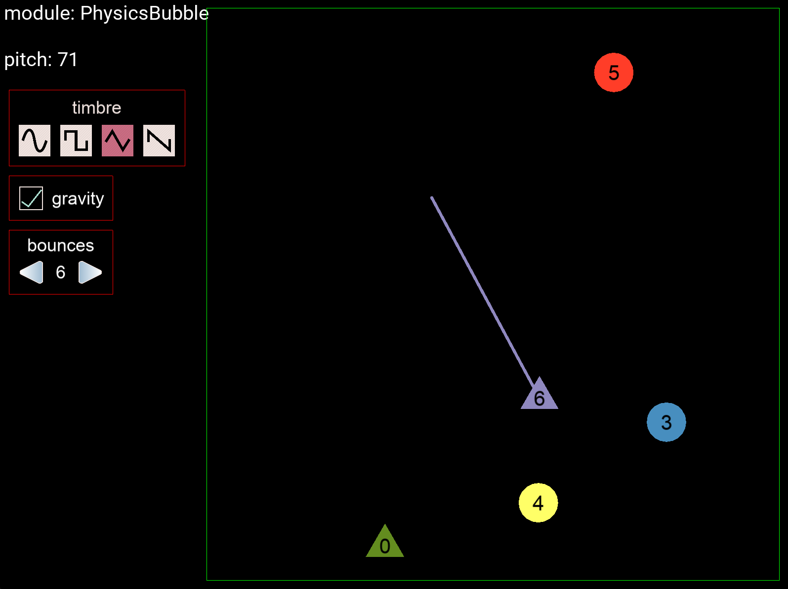

# interval

### project members
- joon ko (joonhok)
- nisha devasia (ndevasia)

### [proposal document](https://docs.google.com/document/d/1v-Yr0-7mmmqrQtp-VLZKAsVBiACLiTvRRZDyHPhV9q4/edit?usp=sharing)

### setup locally
1. we assume you already have all 21M.385 dependencies installed (esp. Kivy).
2. clone and cd into this repository.
3. `pip install -r requirements.txt`
4. run the server with `python server.py`.
5. in `client.py`, change `server_url` to the public IP address of the computer used to run the server, then run the client with `python client.py`.

#### keyboard shortcuts (be a pro!)

- z: PhysicsBubble
- x: SoundBlock
- *PhysicsBubble*
  - qwertyui: pitch select (white keys)
  - 23567: pitch select (black keys)
  - [, ]: pitch select octave down, octave up
  - asdf: timbre select (sine, square, triangle, sawtooth)
  - g: toggle gravity
  - left, right: # of bounces down, up